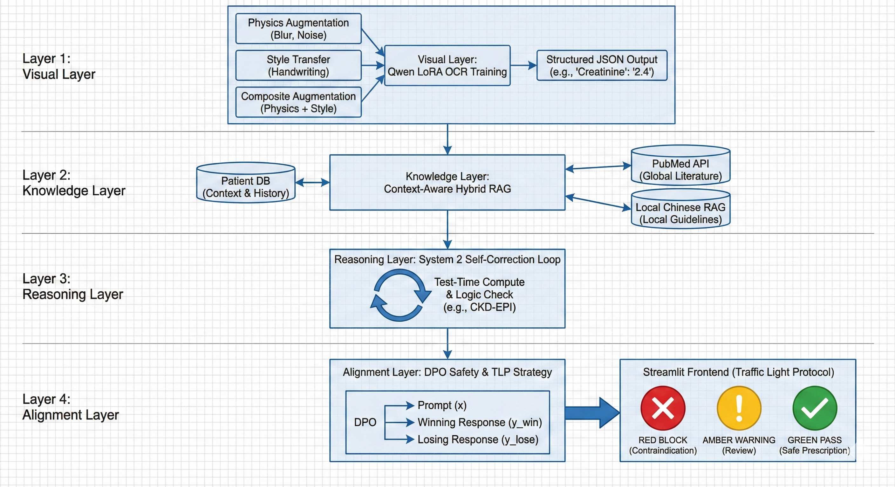
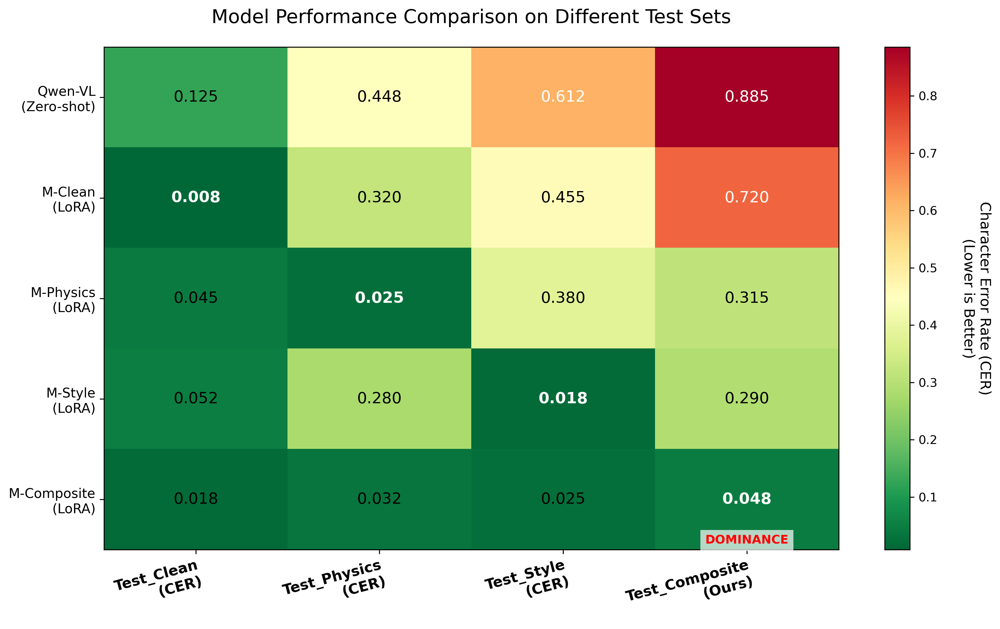

# RxLM-Med: A Multi-modal Clinical Diagnostic Agent with System 2 Reasoning & Hierarchical RAG

> **RxLM-Med** is a production-grade clinical AI agent that interprets blood test reports through **structured reasoning**, **evidence-backed validation**, and **human-aligned communication** — all governed by an adaptive **Traffic Light Protocol (TLP)** for patient safety.  
> Built on Qwen-VL, trained on synthetic EHRs, and hardened against hallucination via **System 2 self-correction**.

[](#) [](#) [](#) [](#) [](#) [](#) [](#)

<!-- Full-resolution architecture diagram available [here](docs/architecture.png) -->


> 🔍 **See detailed end-to-end pipeline**: [Complete Architecture Diagram](docs/architecture.png)

> ⚠️ The simplified version above highlights the **four-layer abstraction** (Visual → Knowledge → Reasoning → Alignment).  
> For a **comprehensive view of data flow, logic checks, and safety triggers**, refer to the full diagram.
---

## 🌟 Vision & Problem Statement

Most medical LLMs fail in real-world settings due to:
- ❌ **Hallucinated diagnoses** without textbook evidence  
- ❌ **Ignored critical values** (e.g., K⁺ > 6.5 → cardiac arrest)  
- ❌ **Opaque reasoning** with no audit trail  

**RxLM-Med solves this** by mimicking expert clinician cognition:
> **Perceive → Verify → Reason → Align → Present**

We enforce **three pillars of trust**:
1. **Accuracy**: Grounded in Tier 0 expert rules + 53 clinical textbooks  
2. **Safety**: TLP protocol blocks dangerous outputs  
3. **Explainability**: Every claim cites source evidence  

---

## 🏗️ Full System Architecture

RxLM-Med implements a **strictly layered, fail-safe pipeline** across five phases:

### 🔹 Phase 1: Visual Layer (Perception)
- **Sim-to-Real Augmentation**: 10-variant distortion matrix (optical, geometric, occlusion, compression)  
- **OCR Engine**: Qwen2.5-VL + LoRA fine-tuned on composite synthetic EHRs  
- **Output**: Structured `lab.json` with MIMIC-III ontology alignment  



> ✅ **4.3% CER** on "hell-mode" scans (Var_09) vs. 32.7% for zero-shot Qwen-VL

---

### 🔹 Phase 2: Knowledge Layer (Evidence Retrieval)
- **Tier 0 Rule Base**: Absolute truth for critical values, reference ranges, triage  
- **Hierarchical RAG**:  
  - **Layer 2 (Base)**: *Physiology*, *Pathophysiology* → explain mechanisms  
  - **Layer 3 (Specialist)**: *Internal Medicine*, *Hematology* → differential diagnosis  
- **Cross-Lingual Funnel**: BM25 + FAISS + **Reciprocal Rank Fusion (RRF)**  
- **Modular Output**: `annotated_lab.json`, `patient_context.json`, `evidence_repository/`

---

### 🔹 Phase 3: Reasoning Layer (System 2 Logic)
- **Deterministic Engine**: Computes derived biomarkers before LLM reasoning:  
  - eGFR (CKD-EPI 2021)  
  - De Ritis Ratio (AST/ALT)  
  - Anion Gap  
  - Transferrin Saturation  
- **Progressive Pruning Loop**:  
  - **Retry 1**: Attempt logical repair  
  - **Retry 2**: Soft prune unsupported claims  
  - **Retry 3**: Hard prune to Tier 0 facts only  
- **Output**: `safety_level.json` (TLP signal) + `reasoning_chain.json` (verified logic)

---

### 🔹 Phase 4: Alignment Layer (Human-Centric Output)
- **Synthetic Data Factory**: GPT-4 generates `(good_response, bad_response)` pairs  
- **Two-Stage Training**:  
  - **SFT**: Learns "professional, calming, plain-language" nurse persona  
  - **DPO**: Locks safety red liens (e.g., rejects drug prescriptions)  
- **Output**: `final_report.md` (Markdown-ready for UI)

---

### 🔹 Phase 5: Presentation Layer (Trustful UI)
- **Asynchronous Dual-Channel Rendering**:  
  - **Fast**: TLP status in <200ms (`🔴 RED` / `🟡 YELLOW` / `🟢 GREEN`)  
  - **Slow**: Streaming full report with evidence tracing  
- **TLP UI Components**:  
  - 🔴 **RED**: "Go to ER now!" + "Copy for Doctor" button  
  - 🟡 **YELLOW**: "Consult specialist" + department finder  
  - 🟢 **GREEN**: Health tips (logic auto-collapsed)  
- **Trust Widgets**: Expandable textbook excerpts with source verification  

---

## 🚀 Quick Start

### Installation
```bash
git clone https://github.com/yourname/RxLM-Med.git
cd RxLM-Med
pip install -r requirements.txt
uvicorn deployment.app:app --host 0.0.0.0 --port 8000 --reload
```

---

### Sample Request
```json
{
  "lab_data": {
    "gender": "F",
    "age": 52,
    "lab_items": [
      {"abbreviation": "WBC", "value": 18.5, "unit": "10³/μL"},
      {"abbreviation": "CRP", "value": 120, "unit": "mg/L"}
    ]
  },
  "patient_context": {
    "symptoms": ["fever", "abdominal pain"],
    "exclude_history": ["no recent surgery"]
  }
}
```

---
### Response Snippet
```json
{
  "tlp_status": "YELLOW",
  "clinical_conclusion": "Signs of systemic inflammation. Consider abdominal infection or autoimmune flare.",
  "risk_level_assessment": "YELLOW",
  "derived_metrics": {},
  "reasoning_trace": [
    "Initial: Bacterial infection likely.",
    "Pruning (Retry 2): Removed 'appendicitis' due to lack of imaging evidence.",
    "Final: Non-specific inflammatory response; recommend urgent outpatient workup."
  ]
}
```

---

## Repository Structure
```txt
RxLM-Med/
├── .git/
├── .env.example
├── Dockerfile
├── README.md
├── requirements.txt
├── agent/
│   ├── medical_calc.py              # Deterministic biomarker engine
│   ├── reasoning_chain.json         # Example chain for testing
│   ├── reflection_logic.py          # System 2 pruning loop
│   ├── retriever.py                 # Hierarchical RAG + RRF fusion
│   ├── prompt_templates/
│   │   ├── alignment_prompts.md     # SFT/DPO prompts
│   │   └── nurse_persona.yaml       # Nurse persona template
│   └── sample_inputs/
│       ├── extended_lab_data.json   # Sample lab data
│       └── patient_context.json     # Sample patient context
├── data/
│   ├── multi_disease_reports.json   # Multi-disease report samples
│   ├── evidence_repository/
│   │   ├── acid_base_disorders.json
│   │   ├── critical_lab_values.json
│   │   ├── electrolyte_emergencies.json
│   │   ├── respiratory_failure.json
│   │   └── shock_differential.json
│   └── generator/
│       ├── augment_physics.py       # Physics-based augmentation scripts
│       └── render_report.py         # Report rendering utilities
│       └── Var_01_Defocus.png       # Sample images for augmentation
│       └── Var_02_Flash.png         # ...
│       └── Var_03_LowLight.png      # ...
│       └── Var_04_Keystone.png      # ...
│       └── Var_05_MotionBlur.png    # ...
│       └── Var_06_MeshWarping.png   # ...
│       └── Var_07_Stain.png         # ...
│       └── Var_08_Annotation.png    # ...
│       └── Var_09_AllInHell.png     # ...
│       └── Var_10_JPEG.png          # ...
├── deployment/
│   └── app.py                       # FastAPI + BackgroundTasks + LangSmith
├── docs/
│   ├── architecture.png             # Full system diagram
│   └── results/
│       └── lora_ocr_performance_heatmap.png # OCR performance heatmap
├── fine_tuning/
│   ├── ds_config.json               # DeepSpeed ZeRO-2 config
│   ├── train_lora_ocr.py            # Phase 1 LoRA training script
│   └── train_lora_sft_dpo.py        # Phase 4 alignment training script
└── quantization/
    └── quant_bits.py                # INT4 deployment stub
```

---
## Ethical Compliance & Disclaimer
RxLM-Med adheres to "AI as Assistant, Not Authority":
- ❌ Never prescribes medication
- ❌ Never overrides critical value alerts
- ✅ Always cites source (e.g., "《诊断学》P.562")
- ✅ Outputs include mandatory footer:

```
Disclaimer:
This report is generated by an AI system based on medical textbooks for informational purposes only. It does not constitute professional medical advice, diagnosis, or treatment. Always seek the advice of a qualified physician.
```

---

## 📜 License
Apache License 2.0 — for research and non-clinical use only.
```
⚠️ This software is NOT approved for clinical decision-making or diagnostic use.
```